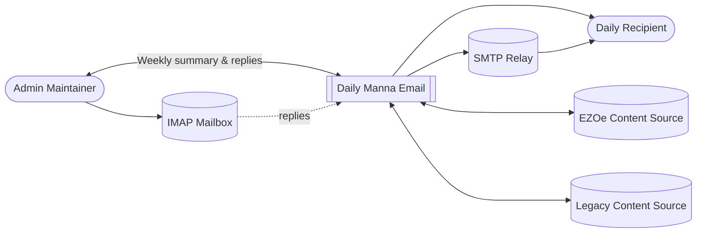
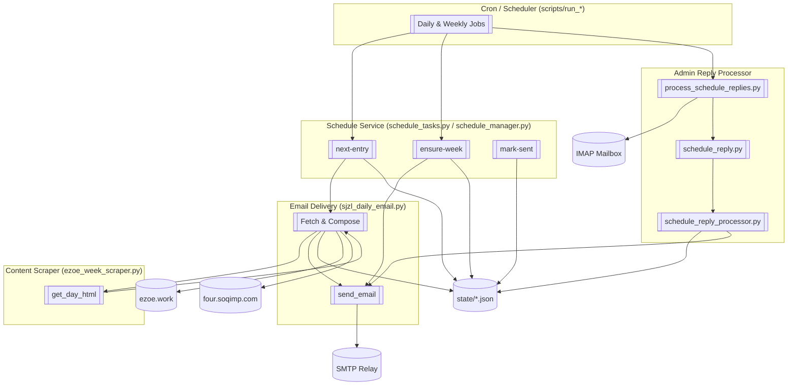
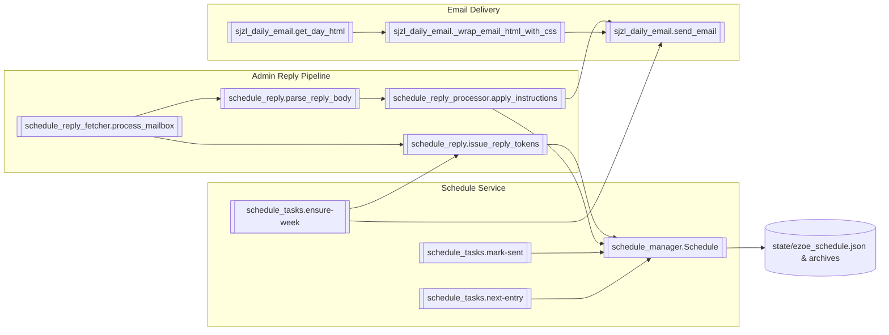

# Daily Manna Email — C4 Model

## Level 1 · System Context

- **Person · Daily Recipient** — receives the daily "聖經之旅" email content; no direct interaction other than reading messages.
- **Person · Admin Maintainer** — reviews weekly summaries, sends adjustment replies, and oversees delivery.
- **System · Daily Manna Email** — automates lesson selection, email delivery, scheduling, and admin feedback processing.
- **System · EZOe Content Source (ezoe.work)** — provides lesson HTML scraped for selector-based sends.
- **System · Legacy Content Source (four.soqimp.com)** — fallback lesson discovery endpoint for SJZL mode.
- **System · SMTP Relay** — external email service used for all outbound messages.
- **System · IMAP Mailbox** — inbound channel for admin reply processing.



```
[Admin Maintainer] ⇄ [Daily Manna Email] ⇄ (SMTP Relay / IMAP Mailbox)
             ↑                          ⇣
       (Weekly summary & replies)   [Daily Recipient]

[Daily Manna Email] ⇄ [EZOe Content Source]
[Daily Manna Email] ⇄ [Legacy Content Source]
```

## Level 2 · Containers

| Container | Tech | Responsibilities | Key Interactions |
|-----------|------|------------------|------------------|
| **Cron / Scheduler** | Bash (`scripts/run_*`) | Entry points triggered by cron; loads `.env`; invokes Python CLIs. | Calls Python containers below. |
| **Schedule Service** | Python (`schedule_tasks.py`, `schedule_manager.py`) | Maintains `state/ezoe_schedule.json`; calculates next selector; renders weekly summaries; issues reply tokens. | Reads/writes JSON state; invokes Email Delivery. |
| **Email Delivery** | Python (`sjzl_daily_email.py`) | Fetches lesson HTML, wraps content, composes multipart emails, sends via SMTP. | Reads env vars; calls `requests` for scraping; uses SMTP relay. |
| **Content Scraper** | Python (`ezoe_week_scraper.py`) | Pulls specific lesson/day HTML from ezoe.work with UTF-8 safeguards. | Invoked by Email Delivery when `EZOE_SELECTOR` is set. |
| **Admin Reply Processor** | Python (`schedule_reply.py`, `schedule_reply_processor.py`, `schedule_reply_fetcher.py`, `scripts/process_schedule_replies.py`) | Fetches IMAP mail, parses reply tokens, applies adjustments, sends confirmation emails, archives results. | Reads IMAP; updates schedule; calls Email Delivery. |
| **State Store** | JSON files (`state/*.json`) | Persists schedule, weekly summary, and reply processing outcomes. | Used by Schedule Service and Admin Reply Processor. |

Data flow: Cron scripts orchestrate the Schedule Service, which selects a selector, triggers the Email Delivery container (which in turn uses the Content Scraper when needed) and updates the State Store. Admin Reply Processor reads weekly emails, applies modifications to the State Store, and sends confirmations through Email Delivery.



## Level 3 · Components (Schedule Service & Admin Loop)

### Schedule Service Components

| Component | Responsibility | Notes |
|-----------|----------------|-------|
| `schedule_manager.Schedule` | Core model for entries; handles persistence, timezone logic, and lookups. | Stores data in `state/ezoe_schedule.json` (override via `SCHEDULE_FILE`). |
| `schedule_tasks.next-entry` | CLI to compute the next selector/date pair, honoring overrides (`EZOE_SEND_WEEKDAY`, `EZOE_SEND_DATE`). | Exported selector feeds the daily runner. |
| `schedule_tasks.ensure-week` | Pre-populates upcoming week, issues reply tokens, renders HTML & text summaries. | Sends admin email via `sjzl_daily_email.send_email` when `--email`. |
| `schedule_tasks.mark-sent` | Updates entry status to `sent` with timestamp after successful delivery. | Called by `run_daily_stateful_ezoe.sh`. |

### Email Delivery Components

| Component | Responsibility | Notes |
|-----------|----------------|-------|
| `sjzl_daily_email.get_day_html` (via `ezoe_week_scraper`) | Retrieves HTML for a given selector; adds `<h3>` headings; strips chrome. | Ensures UTF-8 decoding and polite delays. |
| `sjzl_daily_email._wrap_email_html_with_css` | Scopes inline and linked CSS for safe email rendering. | Combines content with `<meta charset='utf-8'>`. |
| `sjzl_daily_email.send_email` | Sends multipart/alternative emails via SMTP (`SMTP_HOST`, `SMTP_USER`, etc.). | Reused by weekly summaries and reply confirmations. |

### Admin Reply Components

| Component | Responsibility | Notes |
|-----------|----------------|-------|
| `schedule_reply.issue_reply_tokens` | Generates expiring tokens stored in schedule metadata. | Adds `meta.reply_tokens` entries with TTL. |
| `schedule_reply.parse_reply_body` | Parses admin email commands (`[TOKEN] verb args…`). | Supports verbs: `keep`, `skip`, `move`, `selector`, `status`, `note`, `override`. |
| `schedule_reply_processor.apply_instructions` | Applies parsed commands to schedule entries, tracking outcome. | Removes tokens on success; flags errors for confirmation email. |
| `schedule_reply_fetcher.process_mailbox` | Connects to IMAP, filters allowed senders, extracts text, invokes processor, archives results. | Uses `ADMIN_REPLY_*` and `IMAP_*` env vars. |
| `scripts/process_schedule_replies.py` | CLI wrapper with `--limit` and `--dry-run` for cron/tests. | Used by `scripts/run_schedule_reply_processor.sh`. |



## Deployment & Infrastructure Notes

- **Environment Configuration** — `.env` holds SMTP, IMAP, and schedule overrides; scripts source it automatically. Key vars: `EZOE_SELECTOR`, `SMTP_*`, `EMAIL_*`, `ADMIN_SUMMARY_*`, `IMAP_*`, `RUN_FORCE`, `EZOE_VOLUME/EZOE_LESSON/EZOE_DAY_START`.
- **State Management** — JSON files under `state/` act as lightweight persistence. Ensure cron jobs have read/write access.
- **External Dependencies** — Outbound HTTPS (scraping), SMTP, and IMAP connectivity must be available. Rate limiting is enforced via `POLITE_DELAY_MS`.

This textual C4 description complements `SYSTEM_ARCHITECTURE.md` by emphasizing structural boundaries and interactions across system levels.
