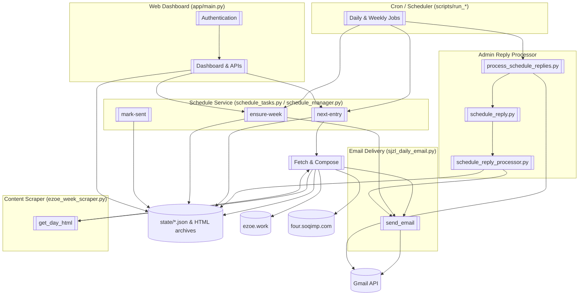
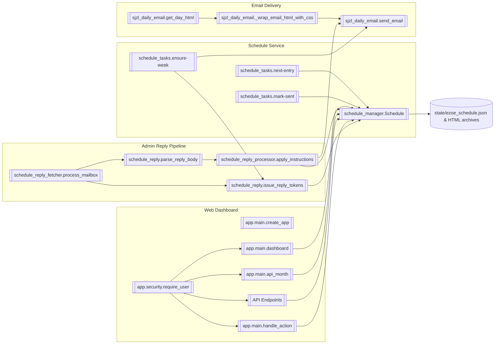

# Daily Manna Email — C4 Model

## Level 1 · System Context

- **Person · Daily Recipient** — receives the daily "聖經之旅" email content; no direct interaction other than reading messages.
- **Person · Admin Maintainer** — reviews weekly summaries, sends adjustment replies, and oversees delivery.
- **Person · Web Admin** — accesses the web dashboard to interactively manage schedule entries, view calendar, and perform administrative tasks.
- **System · Daily Manna Email** — automates lesson selection, email delivery, scheduling, admin feedback processing, and provides a web dashboard for management.
- **System · EZOe Content Source (ezoe.work)** — provides lesson HTML scraped for selector-based sends.
- **System · Legacy Content Source (four.soqimp.com)** — fallback lesson discovery endpoint for SJZL mode.
- **System · Gmail API** — OAuth-authenticated service for sending emails and reading admin replies.


```
[Admin Maintainer] ⇄ [Daily Manna Email] ⇄ Gmail API
             ↑                          ⇣
       (Weekly summary & replies)   [Daily Recipient]

[Web Admin] ⇄ [Daily Manna Email]

[Daily Manna Email] ⇄ [EZOe Content Source]
[Daily Manna Email] ⇄ [Legacy Content Source]
```

## Level 2 · Containers

| Container | Tech | Responsibilities | Key Interactions |
|-----------|------|------------------|------------------|
| **Cron / Scheduler** | Bash (`scripts/run_*`) | Entry points triggered by cron; loads `.env`; invokes Python CLIs. | Calls Python containers below. |
| **Schedule Service** | Python (`schedule_tasks.py`, `schedule_manager.py`) | Maintains `state/ezoe_schedule.json`; calculates next selector; renders weekly summaries; issues reply tokens. | Reads/writes JSON state; invokes Email Delivery and Web Dashboard. |
| **Email Delivery** | Python (`sjzl_daily_email.py`) | Fetches lesson HTML, wraps content, composes multipart emails, sends via Gmail API. | Reads env vars; calls `requests` for scraping; uses Gmail API. |
| **Content Scraper** | Python (`ezoe_week_scraper.py`) | Pulls specific lesson/day HTML from ezoe.work with UTF-8 safeguards. | Invoked by Email Delivery when `EZOE_SELECTOR` is set. |
| **Admin Reply Processor** | Python (`schedule_reply.py`, `schedule_reply_processor.py`, `schedule_reply_fetcher.py`, `scripts/process_schedule_replies.py`) | Fetches Gmail API mail, parses reply tokens, applies adjustments, sends confirmation emails, archives results. | Uses Gmail API; updates schedule; calls Email Delivery. |
| **Web Dashboard** | Python (FastAPI, `app/main.py`, `app/templates`, `app/static`) | Provides interactive web interface for viewing and editing schedule entries, calendar display, and administrative actions. | Reads/writes JSON state via Schedule Service; handles authentication. |
| **State Store** | JSON files (`state/*.json`) | Persists schedule, weekly summary, reply processing outcomes, and HTML archives. | Used by Schedule Service, Admin Reply Processor, and Web Dashboard. |

Data flow: Cron scripts orchestrate the Schedule Service, which selects a selector, triggers the Email Delivery container (which in turn uses the Content Scraper when needed) and updates the State Store. Admin Reply Processor reads weekly emails, applies modifications to the State Store, and sends confirmations through Email Delivery. Web Dashboard provides interactive access to Schedule Service and State Store for manual management.



## Level 3 · Components (Schedule Service, Admin Loop & Web Dashboard)

### Schedule Service Components

| Component | Responsibility | Notes |
|-----------|----------------|-------|
| `schedule_manager.Schedule` | Core model for entries; handles persistence, timezone logic, and lookups. | Stores data in `state/ezoe_schedule.json` (override via `SCHEDULE_FILE`). |
| `schedule_tasks.next-entry` | CLI to compute the next selector/date pair, honoring overrides (`EZOE_SEND_WEEKDAY`, `EZOE_SEND_DATE`). | Exported selector feeds the daily runner. |
| `schedule_tasks.ensure-week` | Pre-populates upcoming week, issues reply tokens, renders HTML & text summaries. | Sends admin email via `sjzl_daily_email.send_email` when `--email`. |
| `schedule_tasks.mark-sent` | Updates entry status to `sent` with timestamp after successful delivery. | Called by `run_daily_stateful_ezoe.sh`. |

### Email Delivery Components

| Component | Responsibility | Notes |
|-----------|----------------|-------|
| `sjzl_daily_email.get_day_html` (via `ezoe_week_scraper`) | Retrieves HTML for a given selector; adds `<h3>` headings; strips chrome. | Ensures UTF-8 decoding and polite delays. |
| `sjzl_daily_email._wrap_email_html_with_css` | Scopes inline and linked CSS for safe email rendering. | Combines content with `<meta charset='utf-8'>`. |
| `sjzl_daily_email.send_email` | Sends multipart/alternative emails via Gmail API (`SMTP_USER`, `EMAIL_FROM`, etc.). | Reused by weekly summaries and reply confirmations. |

### Admin Reply Components

| Component | Responsibility | Notes |
|-----------|----------------|-------|
| `schedule_reply.issue_reply_tokens` | Generates expiring tokens stored in schedule metadata. | Adds `meta.reply_tokens` entries with TTL. |
| `schedule_reply.parse_reply_body` | Parses admin email commands (`[TOKEN] verb args…`). | Supports verbs: `keep`, `skip`, `move`, `selector`, `status`, `note`, `override`. |
| `schedule_reply_processor.apply_instructions` | Applies parsed commands to schedule entries, tracking outcome. | Removes tokens on success; flags errors for confirmation email. |
| `schedule_reply_fetcher.process_mailbox` | Uses Gmail API, filters allowed senders, extracts text, invokes processor, archives results. | Uses `ADMIN_REPLY_*` env vars. |
| `scripts/process_schedule_replies.py` | CLI wrapper with `--limit` and `--dry-run` for cron/tests. | Used by `scripts/run_schedule_reply_processor.sh`. |

### Web Dashboard Components

| Component | Responsibility | Notes |
|-----------|----------------|-------|
| `app.main.create_app` | Bootstraps FastAPI app with mounted static files, Jinja2 templates, and routes. | Imports schedule modules; configures authentication middleware. |
| `app.main.dashboard` | Renders calendar dashboard HTML; loads week data via Schedule. | Requires authentication; displays start/end week, messages/errors. |
| `app.main.api_month` | JSON API for monthly calendar grid with entry serialization. | Fetches schedule entries; includes calendar grid padding. |
| API endpoints (`api_upsert_entry`, `api_move_entry`, `api_move_entries`) | Handles CRUD operations on schedule entries via JSON payloads. | Validates payloads; persists to JSON state. |
| `app.main.handle_action` | Processes form-based actions (mark sent, skip, note, move, etc.). | Accepts form data; redirects with messages/errors. |
| `app.security.require_user` | Dependency for authentication; checks credentials. | Uses `USERNAME`/`PASSWORD` env vars or default. |



## Deployment & Infrastructure Notes

- **Environment Configuration** — `.env` holds Gmail API, dashboard credentials (`USERNAME`, `PASSWORD`), and schedule overrides; scripts source it automatically. Key vars: `EZOE_SELECTOR`, `SMTP_*`, `EMAIL_*`, `ADMIN_SUMMARY_*`, `RUN_FORCE`, `EZOE_VOLUME/EZOE_LESSON/EZOE_DAY_START`.
- **State Management** — JSON files and HTML archives under `state/` act as lightweight persistence. Ensure cron jobs and web server have read/write access.
- **External Dependencies** — Outbound HTTPS (scraping) and Gmail API connectivity must be available. Rate limiting is enforced via `POLITE_DELAY_MS`.
- **Web Deployment** — FastAPI app can be run via `uvicorn` or ASGI server; mounted static files and Jinja2 templates for frontend assets.

This textual C4 description complements `SYSTEM_ARCHITECTURE.md` by emphasizing structural boundaries and interactions across system levels.
